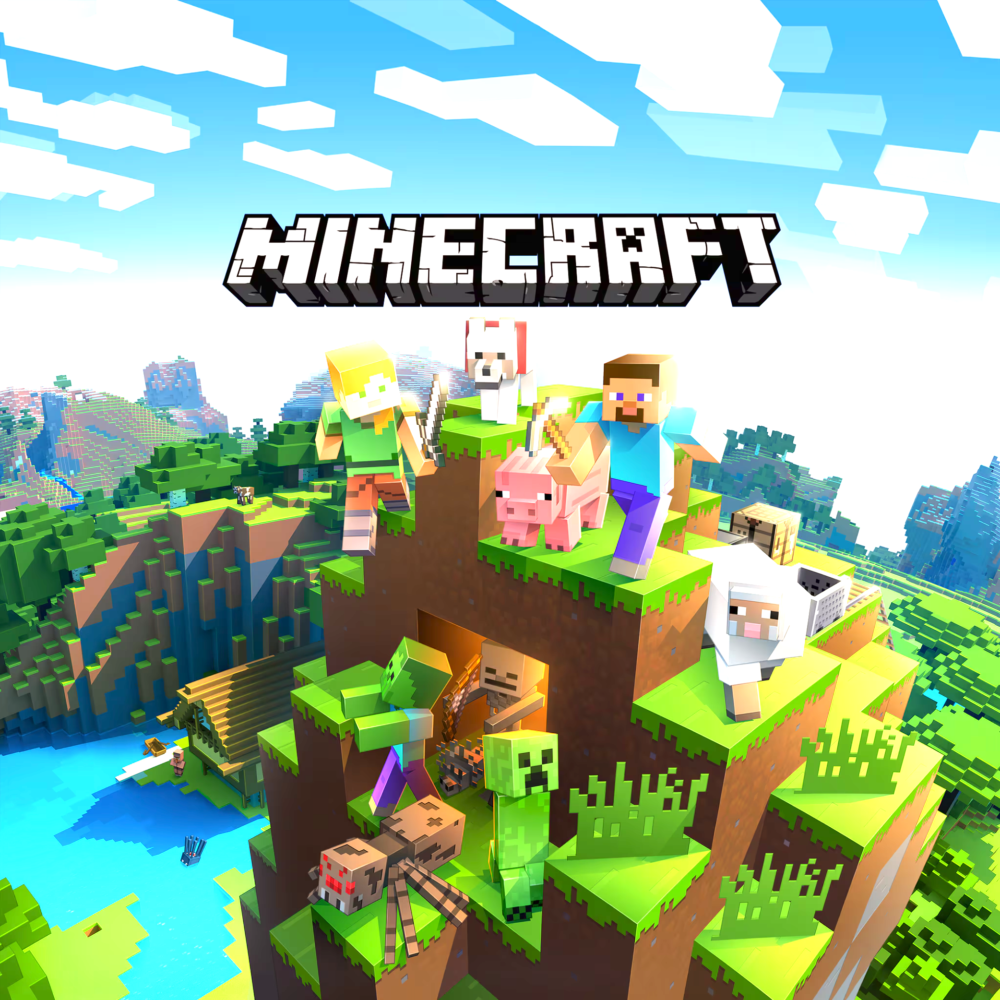
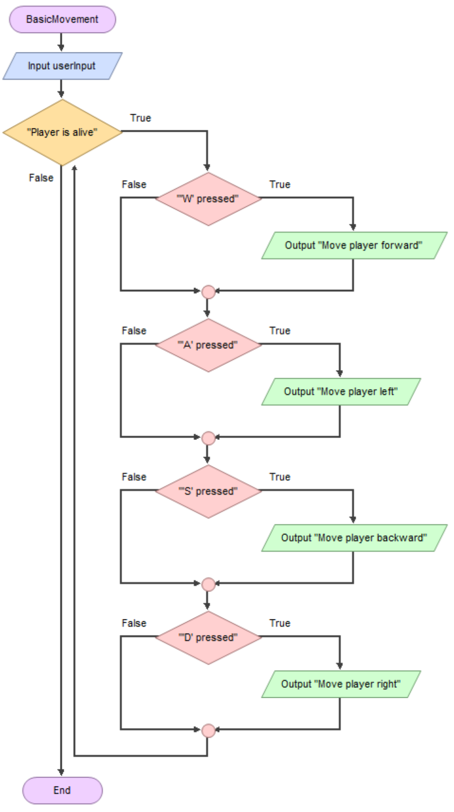
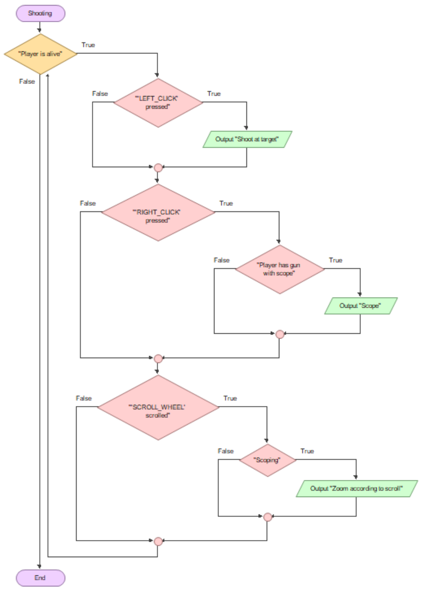
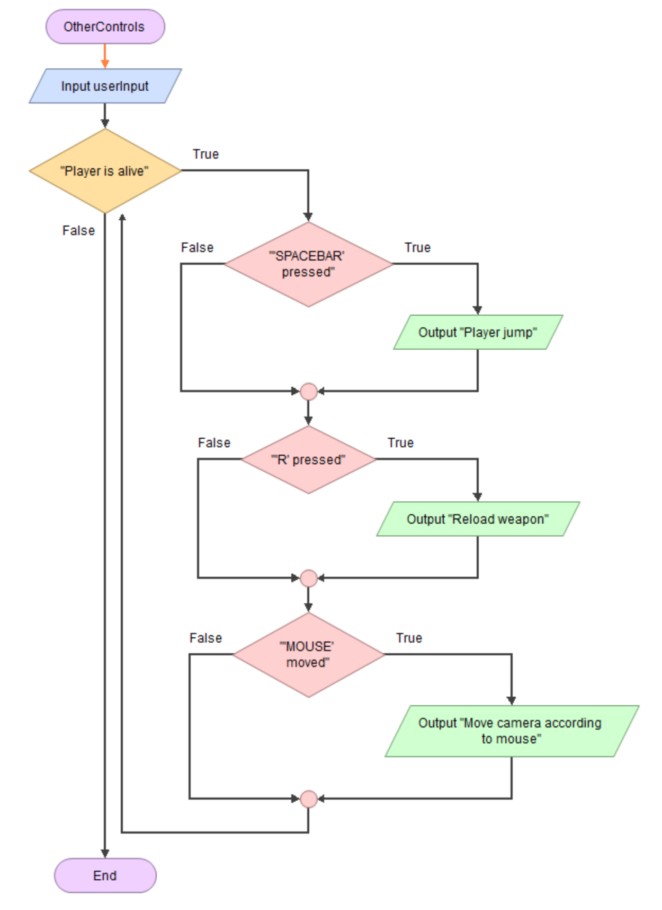
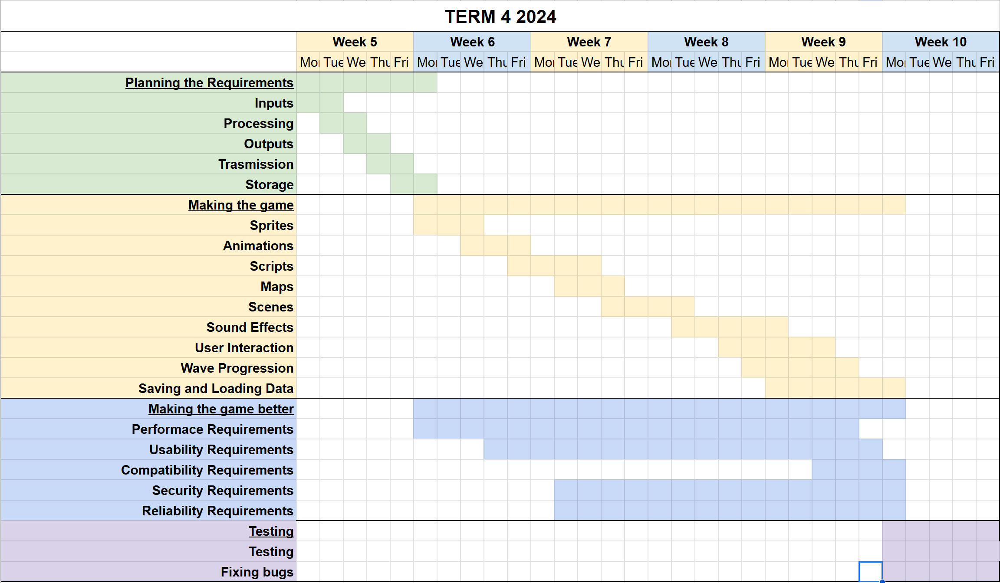

# Identifying and Defining

## Brainstorming
**Ideas:**
- horror FPS game that scares the crap out of someone when they see an enemy
- racing game simulator, like a driving simulator
- create a universal benchmark game that can accurately test the power of any build (FPS but literally)
- insert more ideas here

**Controls:**\
- W,A,S,D to move (for the FPS game)
- SPACE to jump (for the FPS game)
- LEFT MOUSE to shoot (for the FPS game)
- RIGHT MOUSE to scope (for the FPS game)

**Need:**\
To allow teenagers to regain their spatial awareness and slowly relieve off the pointless scrolling through social media platforms.

**Problem Statement:**\
Teenagers generally find video games not as engaging as before as they slowly transition to social media platforms such Instragram Reels, YouTube Shorts and TikTok; which can cause more harm to their brain than video games, especially with the category of 'brainrot'. A Horror FPS game with realistic graphics can bring them back into games while helping train their spatial awareness as they must consistently look around otherwise they could end up being killed in game, which is not desirable.

**Skill Development:**\
In order to create this game, I will use Roblox Studio of Unity. To acquire these set skills, I will follow a series of Roblox Studio or Unity tutorials that I found searching YouTube. Using Unity and ROblox together allows my game to be more widespread as it adresses both the current and upcoming generations.

## Requirements Outline
**Inputs:**\
User inputs will include directional keyboard keys for character movement, spacebar for jumping as well as the mouse to move their camera and left-click to shoot. There will also be right-click to scope and middle button to zoom while scoping.

**Processing:**\
The program will operate the player according to which keys they have pressed and where they move their mouse.

**Outputs:**\
The game will display necesary information that can be turned off through the settings, including notifying people when someone joins and leaves their lobby, chat messages and a round over message.

**Transmission:**\
The game will have multiplayer support, and there will be a leaderboard for career kills, hit percentage and Kill Death ratio.

**Storage:**\
The game will store the user's level and career stats and playtime on the device. These shall be accessible in the game.

## Functional and Non-Functional Requirements
### Functional Requirements
**User Interaction:**\
The user will use their keyboard and mouse to move and shoot. The user will also be able to start rounds by pressing a button as well as send friend requests and leave (these will be handled by Roblox).

**Core Gameplay or Simulation Mechanics:**\
W,A,S,D to move, SPACE to jump, LEFT MOUSE to shoot, RIGHT MOUSE to scope and SCROLL to zoom during the scope. Controls should be able to be changed so that 

**Scoring and Feedback (if applicable):**\
At the end of every round, the player with the most kills, most hit percent and most monsters killed will be displayed in the middle. There will be a leaderboard with some of the player's stats such as Kill Death Ratio, kills and hit percent.

**Level Progression or Simulation Stages (if applicable):**\
There may be waves of monsters in game, which allows for more gamemodes such as co-op and tower defense. In order to implement this, I will follow a tutorial on Youtube.

**Saving and Loading Data:**\
The project will save the user's career stats as well as their weapon loadout and previous HP. This will be saved so that it these are accessible in game.

### Non-Functional Requirements
**Performance Requirements:**\
The game should maintain a stable 60FPS even on older devices. This will be tested with my old 2013 MacBook Air.

**Usability Requirements:**\
The game should include a tutorial for new users. This shall be accessible in the settings or in a separate button (Roblox version).

**Compatibility Requirements:**\
The game must be compatible with PC, macOS and Linux for the Unity version and since Roblox is compatible with all of the above and mobile, compatiblity is not an issue.

**Security Requirements:**\
All user data will be stored either on their device (Unity version) or within Roblox (Roblox version). 

**Reliability and Availability:**\
The game shall be available on PC, macOS and Linux and should not be too difficult to run, this way it will not crash or freeze on older and slower hardware. This shall also be able to be played offline with bots (for the Unity version).

### Consideration of Social and Ethical Issues
Equity: The quality of being fair and just in a way that takes account of and addressing existing inequalities.\
Accessibility: The quality of being easy to obtain or use.

**Accessibility:**\
Accessibility features such as subtitles will be included as well as the ability to set your own controls, along with the ability to toggle visual asjustments such as reducing bright colours and colour filters for colourblind people. Another feature that will be added is the abilty to switch mouse buttons for people that use their mouse with their left hand. These features will help the game become more accessible and playable for everyone within the target audience.

**Privacy and Data Protection:**\
The only data that this game will sollect and save is the player's username, controls, settings and stats for the player. These will be stored locally in the Unity version or within Roblox for the Roblox Studio version. Since they are stored locally within the game, all data is stored securely, and when the game is deleted, all the data will be erased with the game. The game will not have a cloud save feature so that all the user's data is protected.

**Fairness and Representation:**\
Since my game will include imaginary horror elements such as monsters, there will be no bias or stereotyping in my game. My game will also include characters that are gender and racially diverse so that there is no bias towards any particular group. This way, there will be no stereotyping or bias from my project, allowing for an inclusive and safe environment and playspace.

**Mental and Emotional Well-Being:**\
The game could affect the user's mental health if other users are cyberbullying them. This could be avoided by censoring harmful language. Another aspect of my game that might affect the user's mental health is the horror theme of the game. Unfortunately, this cannot be fully prevented if I would like to stick to this idea, however, there will be a disclaimer mentioning that the game could potentially scare younger children, as well as advise people wth epilepsy to go straight into the settings and change them.

**Cultural Sensitivities:**\
In order to make sure that minimal aspects of my game are misinterpereted by users, the killing animation will be the same for everybody. There will also be no symbols that are inappropriate, allowing for a racism free game, making the game less offensive and more welcoming. With all this, there should be no cultural sensitivities that could encourage existing players and other people not to play.

# Researching and Planning
## Evaluation of Existing Ideas
### **No.1: Counter Strike: Global Offensive**
| Image of Game | Plus | Minus | Implication |
|-----------------------|------|------|------|
||The game can promote spacial awareness as the player needs to know if there are any enemies nearby | The game can be considered scary due to the inclusion of guns and a bit of gore, so it is not targeted at small children | The fact that this game can be played offline and online means that it can be played anywhere as long as the player has battery |

### **No.2: Minecraft**
| Image of Game | Plus | Minus | Implication |
|--------------------|-------|-------|-------|
||This game targets a wide audience from small children to fully matured adults|The game can still be boring for teenagers as there are too many things that can be done|Since this game is not very realistic, it is relatively easy to run (The minimum requirements is  Core 2 Duo CPU)|

### **No.3: Asphalt 9 Legends/Asphalt Legends Unite**
| Image of Game | Plus | Minus | Implication |
|--------------------|-------|-------|-------|
||This game is extremely immersive as it features realistic cars and semi-realistic settings|This game now does not perform as well as it used to on Non-Apple Silicon Devices|There are not many mechanics to this game, making it not very difficult to grasp for most people|

## Flowchart and Pseudocode
### Pseudocode
**BEGIN** Controls\
&nbsp; INPUT userInput\
&nbsp; WHILE Player is alive\
&nbsp; &nbsp; IF 'W' pressed THEN\
&nbsp; &nbsp; &nbsp; Move player forward\
&nbsp; &nbsp; ELSE IF 'A' pressed THEN\
&nbsp; &nbsp; &nbsp; Move player left\
&nbsp; &nbsp; ELSE IF 'S' pressed THEN\
&nbsp; &nbsp; &nbsp; Move player backward\
&nbsp; &nbsp; ELSE IF 'D' pressed THEN\
&nbsp; &nbsp; &nbsp; Move player right\
&nbsp; &nbsp; ELSE IF 'R' pressed THEN\
&nbsp; &nbsp; &nbsp; Reload ammo in weapon\
&nbsp; &nbsp; ELSE IF 'Spacebar' pressed THEN\
&nbsp; &nbsp; &nbsp; IF player touching ground THEN\
&nbsp; &nbsp; &nbsp; &nbsp; Player jump\
&nbsp; &nbsp; ELSE IF 'LEFT_CLICK' pressed THEN\
&nbsp; &nbsp; &nbsp; IF player has ammo THEN\
&nbsp; &nbsp; &nbsp; &nbsp; Shoot at target\
&nbsp; &nbsp; ELSE IF 'RIGHT_CLICK' pressed THEN\
&nbsp; &nbsp; &nbsp; IF player has gun with scope THEN\
&nbsp; &nbsp; &nbsp; &nbsp; Scope\
&nbsp; &nbsp; &nbsp; &nbsp; IF 'SCROLL_WHEEL' scrolled THEN\
&nbsp; &nbsp; &nbsp; &nbsp; &nbsp; IF scoping THEN\
&nbsp; &nbsp; &nbsp; &nbsp; &nbsp; &nbsp; Zoom according to scroll distance\
&nbsp; &nbsp; IF 'MOUSE' is moved THEN\
&nbsp; &nbsp; &nbsp; Move camera according to mouse\
&nbsp; &nbsp; IF player is on dead
THEN\
&nbsp; &nbsp; &nbsp; BREAK loop\
**END** Controls

### Flowchart
Here are the flowcharts that outline the controls. Due to the flowchart being too large to taks a clear streenshot of as one, I have split them into multiple so that it is easier.\

## Storyboards
This is the flow of how the game would run.\

## Gantt Chart
Here is the Gantt Chart that shows the time management.\
